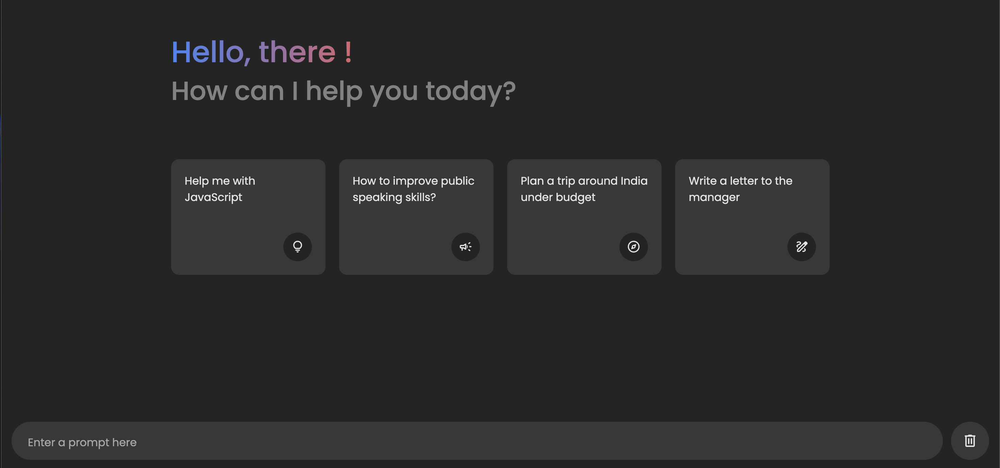

# Chat Application with AI Integration

You can view the live version of the project here: [Live Demo](https://gemini-aniket.netlify.app/)

This project is a simple chat application that integrates with an AI-powered API to generate responses. It features a smooth, interactive chat interface with a loading animation while the AI response is being fetched. The app also allows users to copy AI-generated messages to the clipboard.

## Features

- **AI-powered chat**: Users send a message, and the system queries the API for an AI-generated response.
- **Loading animation**: A loading bar appears while waiting for the AI's response.
- **Message copying**: Users can copy the generated AI response to the clipboard.
- **Responsive design**: The app is fully responsive and works on mobile and desktop devices.

## Technologies Used

- **HTML**: Structure of the chat interface.
- **CSS**: Styling and animations for chat, loading indicators, and interactive elements. 
- **JavaScript**: For fetching API responses, dynamic DOM manipulation, and copying messages to the clipboard.
- **API Integration**: The app integrates with an AI API to fetch responses based on user input.